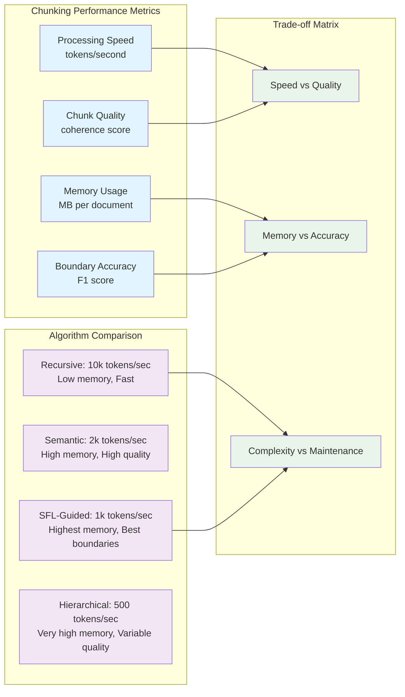

# Chunking Algorithms Deep Dive

## Mathematical Foundations

### Cosine Similarity for Semantic Coherence

```mermaid
graph TB
    %% Vector Space Model
    subgraph "Vector Space Representation"
        Sentence1[Sentence 1] --> Embedding1[Vector E₁]
        Sentence2[Sentence 2] --> Embedding2[Vector E₂]
        
        Embedding1 --> DotProduct[Dot Product: E₁ · E₂]
        Embedding2 --> DotProduct
        
        Embedding1 --> Magnitude1[||E₁||]
        Embedding2 --> Magnitude2[||E₂||]
        
        DotProduct --> CosineSim[Cosine Similarity]
        Magnitude1 --> CosineSim
        Magnitude2 --> CosineSim
    end

    %% Similarity Scoring
    subgraph "Similarity Interpretation"
        CosineSim --> Score{Similarity Score}
        
        Score --> |> 0.8| HighSimilarity[High Similarity<br/>Continue Chunk]
        Score --> |0.5-0.8| ModerateSimilarity[Moderate Similarity<br/>Evaluate Context]
        Score --> |< 0.5| LowSimilarity[Low Similarity<br/>Create Boundary]
        
        HighSimilarity --> SemanticContinuity[Semantic Continuity]
        ModerateSimilarity --> ContextualAnalysis[Contextual Analysis]
        LowSimilarity --> BoundaryCreation[Boundary Creation]
    end

    %% Ruby Implementation
    subgraph "Ruby Algorithm"
        SemanticContinuity --> RubyImplementation[Ruby Implementation]
        ContextualAnalysis --> RubyImplementation
        BoundaryCreation --> RubyImplementation
        
        RubyImplementation --> VectorMath[Vector Mathematics]
        RubyImplementation --> ThresholdLogic[Threshold Logic]
        RubyImplementation --> ChunkGeneration[Chunk Generation]
    end

    %% Styling
    classDef vector fill:#e1f5fe
    classDef similarity fill:#f3e5f5
    classDef implementation fill:#e8f5e8
    
    class Embedding1,Embedding2,DotProduct,Magnitude1,Magnitude2,CosineSim vector
    class Score,HighSimilarity,ModerateSimilarity,LowSimilarity,SemanticContinuity,ContextualAnalysis,BoundaryCreation similarity
    class RubyImplementation,VectorMath,ThresholdLogic,ChunkGeneration implementation
```

### Topic Overlap Algorithm

```mermaid
flowchart TD
    %% Input Processing
    Text1[Text Segment 1] --> NounExtraction1[Noun Extraction]
    Text2[Text Segment 2] --> NounExtraction2[Noun Extraction]
    
    %% Lexical Processing
    subgraph "Lexical Analysis"
        NounExtraction1 --> Lemmatization1[Lemmatization]
        NounExtraction2 --> Lemmatization2[Lemmatization]
        
        Lemmatization1 --> NounSet1[Noun Set 1]
        Lemmatization2 --> NounSet2[Noun Set 2]
    end

    %% Set Operations
    subgraph "Set Theory Operations"
        NounSet1 --> Intersection[Intersection: A ∩ B]
        NounSet2 --> Intersection
        
        NounSet1 --> Union[Union: A ∪ B]
        NounSet2 --> Union
        
        Intersection --> JaccardIndex[Jaccard Index: |A ∩ B| / |A ∪ B|]
        Union --> JaccardIndex
    end

    %% Threshold Decision
    subgraph "Decision Logic"
        JaccardIndex --> ThresholdCheck{Index > 0.3?}
        
        ThresholdCheck --> |Yes| TopicContinuity[Topic Continuity<br/>Maintain Chunk]
        ThresholdCheck --> |No| TopicShift[Topic Shift<br/>New Chunk]
    end

    %% SFL Enhancement
    subgraph "SFL Enhancement"
        TopicContinuity --> ProcessTypeCheck[Process Type Consistency]
        TopicShift --> ProcessTypeTransition[Process Type Transition]
        
        ProcessTypeCheck --> IdeationalContinuity[Ideational Continuity]
        ProcessTypeTransition --> IdeationalBoundary[Ideational Boundary]
    end

    %% Styling
    classDef lexical fill:#e1f5fe
    classDef setops fill:#f3e5f5
    classDef decision fill:#e8f5e8
    classDef sfl fill:#fce4ec
    
    class NounExtraction1,NounExtraction2,Lemmatization1,Lemmatization2,NounSet1,NounSet2 lexical
    class Intersection,Union,JaccardIndex setops
    class ThresholdCheck,TopicContinuity,TopicShift decision
    class ProcessTypeCheck,ProcessTypeTransition,IdeationalContinuity,IdeationalBoundary sfl
```

## Advanced Chunking Algorithms

### Sliding Window with Exponential Decay

```ruby
# Advanced sliding window algorithm with attention weights
class ExponentialDecayChunker
  def initialize(window_size: 5, decay_rate: 0.7, similarity_threshold: 0.6)
    @window_size = window_size
    @decay_rate = decay_rate
    @similarity_threshold = similarity_threshold
    @nlp = Spacy::Language.new('en_core_web_sm')
  end

  def chunk_with_decay(text)
    sentences = extract_sentences(text)
    embeddings = generate_embeddings(sentences)
    
    chunks = []
    current_chunk = []
    window_embeddings = []
    
    sentences.each_with_index do |sentence, index|
      current_embedding = embeddings[index]
      
      if window_embeddings.empty?
        # First sentence always starts a new chunk
        current_chunk = [sentence]
        window_embeddings = [current_embedding]
      else
        # Calculate weighted similarity with decay
        weighted_similarity = calculate_weighted_similarity(
          current_embedding, 
          window_embeddings
        )
        
        if weighted_similarity >= @similarity_threshold
          # Continue current chunk
          current_chunk << sentence
          window_embeddings << current_embedding
          
          # Maintain window size
          if window_embeddings.size > @window_size
            window_embeddings.shift
          end
        else
          # Create new chunk
          chunks << create_chunk_with_metadata(current_chunk, window_embeddings)
          
          current_chunk = [sentence]
          window_embeddings = [current_embedding]
        end
      end
    end
    
    # Add final chunk
    chunks << create_chunk_with_metadata(current_chunk, window_embeddings) unless current_chunk.empty?
    
    chunks
  end

  private

  def calculate_weighted_similarity(current_embedding, window_embeddings)
    return 0.0 if window_embeddings.empty?
    
    weighted_sum = 0.0
    weight_total = 0.0
    
    window_embeddings.reverse.each_with_index do |window_embedding, reverse_index|
      # More recent embeddings get higher weights
      weight = @decay_rate ** reverse_index
      similarity = cosine_similarity(current_embedding, window_embedding)
      
      weighted_sum += similarity * weight
      weight_total += weight
    end
    
    weighted_sum / weight_total
  end

  def cosine_similarity(vec1, vec2)
    dot_product = vec1.zip(vec2).sum { |a, b| a * b }
    magnitude1 = Math.sqrt(vec1.sum { |a| a * a })
    magnitude2 = Math.sqrt(vec2.sum { |a| a * a })
    
    return 0.0 if magnitude1 == 0 || magnitude2 == 0
    
    dot_product / (magnitude1 * magnitude2)
  end

  def create_chunk_with_metadata(sentences, embeddings)
    {
      text: sentences.join(' '),
      sentence_count: sentences.size,
      avg_embedding: calculate_average_embedding(embeddings),
      coherence_score: calculate_internal_coherence(embeddings),
      sfl_metadata: extract_sfl_metadata(sentences)
    }
  end

  def calculate_average_embedding(embeddings)
    return [] if embeddings.empty?
    
    dimensions = embeddings.first.size
    avg_embedding = Array.new(dimensions, 0.0)
    
    embeddings.each do |embedding|
      embedding.each_with_index do |value, index|
        avg_embedding[index] += value
      end
    end
    
    avg_embedding.map { |sum| sum / embeddings.size }
  end

  def calculate_internal_coherence(embeddings)
    return 1.0 if embeddings.size <= 1
    
    similarities = []
    
    (0...embeddings.size-1).each do |i|
      (i+1...embeddings.size).each do |j|
        similarities << cosine_similarity(embeddings[i], embeddings[j])
      end
    end
    
    similarities.sum / similarities.size
  end

  def extract_sfl_metadata(sentences)
    # Placeholder for SFL analysis integration
    {
      process_types: extract_process_types(sentences),
      modality_markers: extract_modality(sentences),
      theme_patterns: extract_theme_patterns(sentences)
    }
  end
end
```

### Hierarchical Agglomerative Chunking

```ruby
# Hierarchical clustering approach for document chunking
class HierarchicalChunker
  def initialize(linkage: :average, distance_threshold: 0.4)
    @linkage = linkage
    @distance_threshold = distance_threshold
    @nlp = Spacy::Language.new('en_core_web_sm')
  end

  def hierarchical_chunk(text)
    sentences = extract_sentences(text)
    embeddings = generate_embeddings(sentences)
    
    # Start with each sentence as its own cluster
    clusters = sentences.map.with_index { |sentence, i| 
      { 
        sentences: [sentence], 
        embedding: embeddings[i],
        indices: [i]
      } 
    }
    
    # Merge clusters until distance threshold is reached
    while clusters.size > 1
      # Find closest cluster pair
      min_distance = Float::INFINITY
      merge_indices = nil
      
      (0...clusters.size-1).each do |i|
        (i+1...clusters.size).each do |j|
          distance = calculate_cluster_distance(clusters[i], clusters[j])
          
          if distance < min_distance
            min_distance = distance
            merge_indices = [i, j]
          end
        end
      end
      
      # Stop if minimum distance exceeds threshold
      break if min_distance > @distance_threshold
      
      # Merge the closest clusters
      cluster1, cluster2 = clusters.values_at(*merge_indices)
      merged_cluster = merge_clusters(cluster1, cluster2)
      
      # Remove original clusters and add merged cluster
      clusters.delete_at(merge_indices[1])
      clusters.delete_at(merge_indices[0])
      clusters << merged_cluster
    end
    
    # Convert clusters to chunks with metadata
    clusters.map { |cluster| create_hierarchical_chunk(cluster) }
  end

  private

  def calculate_cluster_distance(cluster1, cluster2)
    case @linkage
    when :single
      single_linkage_distance(cluster1, cluster2)
    when :complete
      complete_linkage_distance(cluster1, cluster2)
    when :average
      average_linkage_distance(cluster1, cluster2)
    else
      raise ArgumentError, "Unsupported linkage method: #{@linkage}"
    end
  end

  def single_linkage_distance(cluster1, cluster2)
    min_distance = Float::INFINITY
    
    cluster1[:sentences].each_with_index do |sent1, i|
      cluster2[:sentences].each_with_index do |sent2, j|
        embedding1 = cluster1[:embedding].is_a?(Array) ? cluster1[:embedding] : [cluster1[:embedding]][i]
        embedding2 = cluster2[:embedding].is_a?(Array) ? cluster2[:embedding] : [cluster2[:embedding]][j]
        
        distance = 1.0 - cosine_similarity(embedding1, embedding2)
        min_distance = [min_distance, distance].min
      end
    end
    
    min_distance
  end

  def complete_linkage_distance(cluster1, cluster2)
    max_distance = -Float::INFINITY
    
    cluster1[:sentences].each_with_index do |sent1, i|
      cluster2[:sentences].each_with_index do |sent2, j|
        embedding1 = cluster1[:embedding].is_a?(Array) ? cluster1[:embedding] : [cluster1[:embedding]][i]
        embedding2 = cluster2[:embedding].is_a?(Array) ? cluster2[:embedding] : [cluster2[:embedding]][j]
        
        distance = 1.0 - cosine_similarity(embedding1, embedding2)
        max_distance = [max_distance, distance].max
      end
    end
    
    max_distance
  end

  def average_linkage_distance(cluster1, cluster2)
    1.0 - cosine_similarity(cluster1[:embedding], cluster2[:embedding])
  end

  def merge_clusters(cluster1, cluster2)
    merged_sentences = cluster1[:sentences] + cluster2[:sentences]
    merged_indices = cluster1[:indices] + cluster2[:indices]
    
    # Calculate new cluster centroid
    all_embeddings = []
    cluster1[:indices].each { |i| all_embeddings << cluster1[:embedding] }
    cluster2[:indices].each { |i| all_embeddings << cluster2[:embedding] }
    
    merged_embedding = calculate_centroid(all_embeddings)
    
    {
      sentences: merged_sentences,
      embedding: merged_embedding,
      indices: merged_indices
    }
  end

  def calculate_centroid(embeddings)
    return embeddings.first if embeddings.size == 1
    
    dimensions = embeddings.first.size
    centroid = Array.new(dimensions, 0.0)
    
    embeddings.each do |embedding|
      embedding.each_with_index do |value, index|
        centroid[index] += value
      end
    end
    
    centroid.map { |sum| sum / embeddings.size }
  end

  def create_hierarchical_chunk(cluster)
    {
      text: cluster[:sentences].join(' '),
      sentence_indices: cluster[:indices],
      cluster_embedding: cluster[:embedding],
      internal_coherence: calculate_cluster_coherence(cluster),
      sfl_analysis: analyze_cluster_sfl(cluster[:sentences])
    }
  end

  def calculate_cluster_coherence(cluster)
    return 1.0 if cluster[:sentences].size <= 1
    
    # Calculate average pairwise similarity within cluster
    embeddings = cluster[:indices].map { |i| cluster[:embedding] }
    similarities = []
    
    (0...embeddings.size-1).each do |i|
      (i+1...embeddings.size).each do |j|
        similarities << cosine_similarity(embeddings[i], embeddings[j])
      end
    end
    
    similarities.empty? ? 1.0 : similarities.sum / similarities.size
  end
end
```

### SFL-Guided Chunking Algorithm

```ruby
# SFL-aware chunking that uses metafunction analysis for boundaries
class SFLGuidedChunker
  def initialize
    @nlp = Spacy::Language.new('en_core_web_sm')
    @process_classifier = ProcessTypeClassifier.new
    @modality_analyzer = ModalityAnalyzer.new
    @theme_analyzer = ThemeAnalyzer.new
  end

  def sfl_guided_chunk(text)
    sentences = extract_sentences(text)
    metafunction_profiles = analyze_metafunctions(sentences)
    
    chunks = []
    current_chunk = {
      sentences: [],
      profile: nil
    }
    
    sentences.zip(metafunction_profiles).each do |sentence, profile|
      if current_chunk[:profile].nil?
        # Start first chunk
        current_chunk[:sentences] = [sentence]
        current_chunk[:profile] = profile
      else
        profile_compatibility = calculate_profile_compatibility(
          current_chunk[:profile], 
          profile
        )
        
        if profile_compatibility >= 0.7
          # Compatible profiles - continue chunk
          current_chunk[:sentences] << sentence
          current_chunk[:profile] = merge_profiles(current_chunk[:profile], profile)
        else
          # Incompatible profiles - create boundary
          chunks << finalize_chunk(current_chunk)
          
          current_chunk = {
            sentences: [sentence],
            profile: profile
          }
        end
      end
    end
    
    # Add final chunk
    chunks << finalize_chunk(current_chunk) unless current_chunk[:sentences].empty?
    
    chunks
  end

  private

  def analyze_metafunctions(sentences)
    sentences.map do |sentence|
      doc = @nlp.call(sentence)
      
      {
        ideational: analyze_ideational_metafunction(doc),
        interpersonal: analyze_interpersonal_metafunction(doc),
        textual: analyze_textual_metafunction(doc)
      }
    end
  end

  def analyze_ideational_metafunction(doc)
    # Process type classification
    main_verb = doc.select { |token| token.pos == 'VERB' && token.dep == 'ROOT' }.first
    process_type = main_verb ? @process_classifier.classify(main_verb.lemma) : :unknown
    
    # Participant identification
    participants = identify_participants(doc)
    
    # Circumstantial elements
    circumstances = identify_circumstances(doc)
    
    {
      process_type: process_type,
      participants: participants.size,
      circumstances: circumstances.size,
      transitivity_pattern: create_transitivity_pattern(process_type, participants, circumstances)
    }
  end

  def analyze_interpersonal_metafunction(doc)
    # Modality detection
    modality_features = @modality_analyzer.analyze(doc)
    
    # Speech function classification
    speech_function = classify_speech_function(doc)
    
    # Mood analysis
    mood = analyze_mood(doc)
    
    {
      modality_type: modality_features[:type],
      modality_strength: modality_features[:strength],
      speech_function: speech_function,
      mood: mood
    }
  end

  def analyze_textual_metafunction(doc)
    # Theme-Rheme analysis
    theme_rheme = @theme_analyzer.analyze(doc)
    
    # Cohesive devices
    cohesive_devices = identify_cohesive_devices(doc)
    
    # Information structure
    info_structure = analyze_information_structure(doc)
    
    {
      theme_type: theme_rheme[:theme_type],
      rheme_complexity: theme_rheme[:rheme_complexity],
      cohesive_devices: cohesive_devices,
      information_structure: info_structure
    }
  end

  def calculate_profile_compatibility(profile1, profile2)
    ideational_score = calculate_ideational_compatibility(
      profile1[:ideational], 
      profile2[:ideational]
    )
    
    interpersonal_score = calculate_interpersonal_compatibility(
      profile1[:interpersonal], 
      profile2[:interpersonal]
    )
    
    textual_score = calculate_textual_compatibility(
      profile1[:textual], 
      profile2[:textual]
    )
    
    # Weighted average (ideational gets highest weight for chunking)
    (ideational_score * 0.5) + (interpersonal_score * 0.3) + (textual_score * 0.2)
  end

  def calculate_ideational_compatibility(idea1, idea2)
    # Process type compatibility
    process_score = idea1[:process_type] == idea2[:process_type] ? 1.0 : 0.0
    
    # Participant structure similarity
    participant_score = 1.0 - (idea1[:participants] - idea2[:participants]).abs / 
                        [idea1[:participants], idea2[:participants]].max.to_f
    
    # Circumstantial complexity similarity
    circumstance_score = 1.0 - (idea1[:circumstances] - idea2[:circumstances]).abs / 
                         [idea1[:circumstances], idea2[:circumstances]].max.to_f
    
    (process_score * 0.6) + (participant_score * 0.25) + (circumstance_score * 0.15)
  end

  def calculate_interpersonal_compatibility(inter1, inter2)
    # Modality compatibility
    modality_score = inter1[:modality_type] == inter2[:modality_type] ? 1.0 : 0.5
    
    # Speech function compatibility  
    speech_score = inter1[:speech_function] == inter2[:speech_function] ? 1.0 : 0.3
    
    # Mood compatibility
    mood_score = inter1[:mood] == inter2[:mood] ? 1.0 : 0.7
    
    (modality_score * 0.4) + (speech_score * 0.35) + (mood_score * 0.25)
  end

  def calculate_textual_compatibility(text1, text2)
    # Theme type compatibility
    theme_score = text1[:theme_type] == text2[:theme_type] ? 1.0 : 0.6
    
    # Cohesive device continuity
    cohesion_overlap = (text1[:cohesive_devices] & text2[:cohesive_devices]).size
    cohesion_total = (text1[:cohesive_devices] | text2[:cohesive_devices]).size
    cohesion_score = cohesion_total > 0 ? cohesion_overlap.to_f / cohesion_total : 0.5
    
    (theme_score * 0.6) + (cohesion_score * 0.4)
  end

  def merge_profiles(profile1, profile2)
    # Create merged profile representing the chunk so far
    {
      ideational: merge_ideational_profiles(profile1[:ideational], profile2[:ideational]),
      interpersonal: merge_interpersonal_profiles(profile1[:interpersonal], profile2[:interpersonal]),
      textual: merge_textual_profiles(profile1[:textual], profile2[:textual])
    }
  end

  def finalize_chunk(chunk_data)
    {
      text: chunk_data[:sentences].join(' '),
      sentence_count: chunk_data[:sentences].size,
      sfl_profile: chunk_data[:profile],
      coherence_metrics: {
        ideational_coherence: calculate_ideational_coherence(chunk_data[:sentences]),
        interpersonal_coherence: calculate_interpersonal_coherence(chunk_data[:sentences]),
        textual_coherence: calculate_textual_coherence(chunk_data[:sentences])
      }
    }
  end
end
```

## Performance Metrics & Benchmarks



This comprehensive algorithmic foundation provides the mathematical and implementation details needed for robust semantic chunking with SFL integration! 🧮