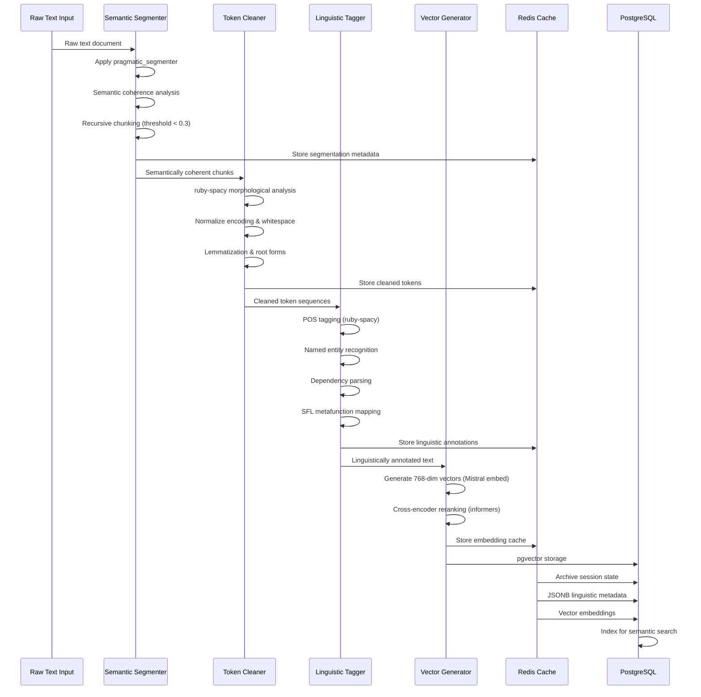
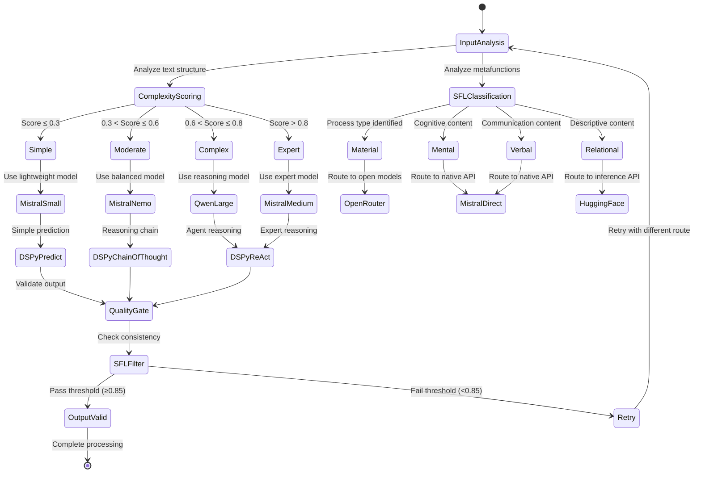
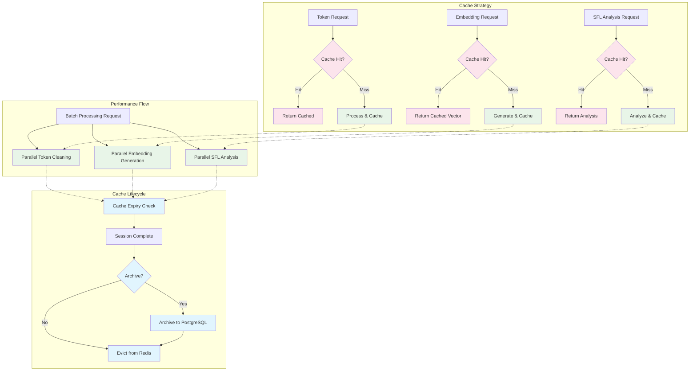

# Data Flow Specification

## Pipeline Data Transformation Flow



## Class Interaction Model

```mermaid
classDiagram
    %% Core Pipeline Classes
    class SemanticSegmenter {
        +segment(text: String): Array~Chunk~
        +apply_coherence_threshold(chunks: Array): Array
        +preserve_context_overlap(chunks: Array): Array
        -pragmatic_boundary_detection()
        -semantic_similarity_scoring()
    }
    
    class TokenCleaner {
        +clean(chunks: Array~Chunk~): Array~TokenSequence~
        +normalize_encoding(text: String): String
        +lemmatize_tokens(tokens: Array): Array
        -ruby_spacy_integration()
        -morphological_analysis()
    }
    
    class LinguisticTagger {
        +tag_pos(tokens: Array): Array~POSToken~
        +extract_entities(tokens: Array): Array~Entity~
        +parse_dependencies(tokens: Array): DependencyTree
        +map_sfl_metafunctions(tokens: Array): SFLAnalysis
        -process_type_identification()
        -modality_analysis()
    }
    
    class VectorGenerator {
        +generate_embeddings(text: String): Vector768
        +batch_embed(texts: Array): Array~Vector768~
        +rerank_results(query: String, docs: Array): Array
        -mistral_embed_integration()
        -informers_reranking()
    }

    %% Cache Models
    class ProcessingSession {
        +id: String
        +stage_progress: Hash
        +intermediate_results: Hash
        +metadata: Hash
        +created_at: Time
        +update_stage(stage: Symbol, data: Hash)
        +mark_complete()
    }
    
    class TokenCache {
        +session_id: String
        +cleaned_tokens: Array
        +lemmatization_map: Hash
        +expiry: Time
        +retrieve_by_session(id: String): TokenCache
    }
    
    class EmbeddingCache {
        +text_hash: String
        +vector: Array~Float~
        +model_version: String
        +created_at: Time
        +find_by_hash(hash: String): Vector
    }

    %% Persistent Models
    class Document {
        +id: UUID
        +original_text: Text
        +processing_status: String
        +metadata: JSONB
        +created_at: Time
        +embeddings: DocumentEmbedding[]
        +annotations: LinguisticAnnotation[]
    }
    
    class LinguisticAnnotation {
        +document_id: UUID
        +pos_tags: JSONB
        +entities: JSONB
        +dependencies: JSONB
        +sfl_analysis: JSONB
        +confidence_scores: JSONB
    }
    
    class DocumentEmbedding {
        +document_id: UUID
        +embedding: Vector(768)
        +model_version: String
        +chunk_index: Integer
        +similarity_search(query_vector: Vector): Array
    }

    %% Relationships
    SemanticSegmenter --> TokenCleaner : chunks
    TokenCleaner --> LinguisticTagger : tokens
    LinguisticTagger --> VectorGenerator : annotated_text
    VectorGenerator --> EmbeddingCache : vectors
    
    ProcessingSession --> TokenCache : session_data
    ProcessingSession --> EmbeddingCache : session_data
    
    TokenCache --> Document : archive
    EmbeddingCache --> DocumentEmbedding : persist
    LinguisticTagger --> LinguisticAnnotation : annotations
    
    Document ||--o{ DocumentEmbedding : contains
    Document ||--o{ LinguisticAnnotation : has
```

## Multi-Provider Routing State Machine



## Cache Strategy & Performance Flow



## Integration Testing Flow

```mermaid
graph LR
    %% Test Data Flow
    TestInput[Test Input Documents] --> StageTests
    
    subgraph "Stage-by-Stage Testing"
        StageTests[Individual Stage Tests]
        SegmentTest[Segmentation Test]
        CleanTest[Token Cleaning Test]
        TagTest[Tagging Test]
        EmbedTest[Embedding Test]
        CacheTest[Cache Integration Test]
        StorageTest[Storage Integration Test]
        
        StageTests --> SegmentTest
        SegmentTest --> CleanTest
        CleanTest --> TagTest
        TagTest --> EmbedTest
        EmbedTest --> CacheTest
        CacheTest --> StorageTest
    end

    %% End-to-End Testing
    subgraph "E2E Pipeline Testing"
        E2ETest[End-to-End Test]
        QualityMetrics[Quality Metrics]
        PerformanceMetrics[Performance Metrics]
        ConsistencyCheck[SFL Consistency Check]
        
        E2ETest --> QualityMetrics
        E2ETest --> PerformanceMetrics
        E2ETest --> ConsistencyCheck
    end

    %% Validation Gates
    subgraph "Validation Gates"
        SchemaValidation[Schema Validation]
        SFLValidation[SFL Validation]
        VectorValidation[Vector Validation]
        IntegrationValidation[Integration Validation]
    end

    StorageTest --> E2ETest
    QualityMetrics --> SchemaValidation
    PerformanceMetrics --> SFLValidation
    ConsistencyCheck --> VectorValidation
    VectorValidation --> IntegrationValidation

    %% Results
    IntegrationValidation --> TestResults[Test Results & Report]

    %% Styling
    classDef test fill:#e3f2fd
    classDef validation fill:#f3e5f5
    classDef results fill:#e8f5e8
    
    class SegmentTest,CleanTest,TagTest,EmbedTest,CacheTest,StorageTest,E2ETest test
    class SchemaValidation,SFLValidation,VectorValidation,IntegrationValidation validation
    class QualityMetrics,PerformanceMetrics,ConsistencyCheck,TestResults results
```

