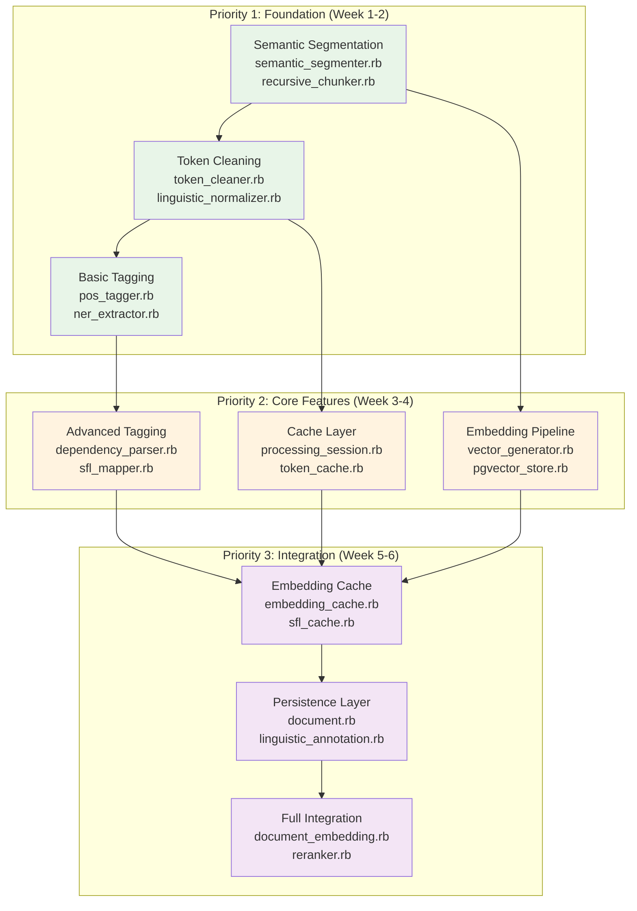
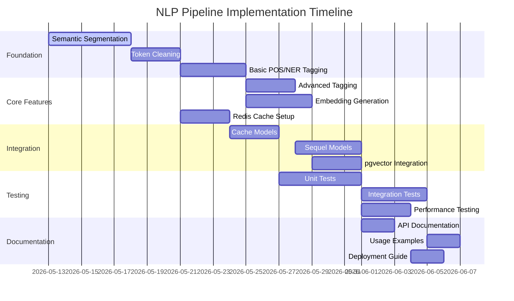
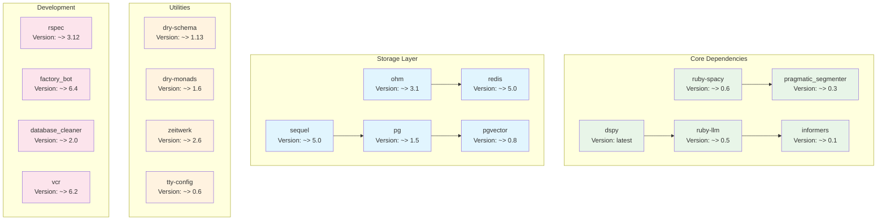
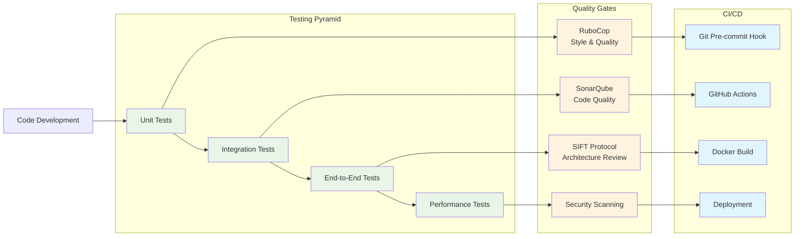
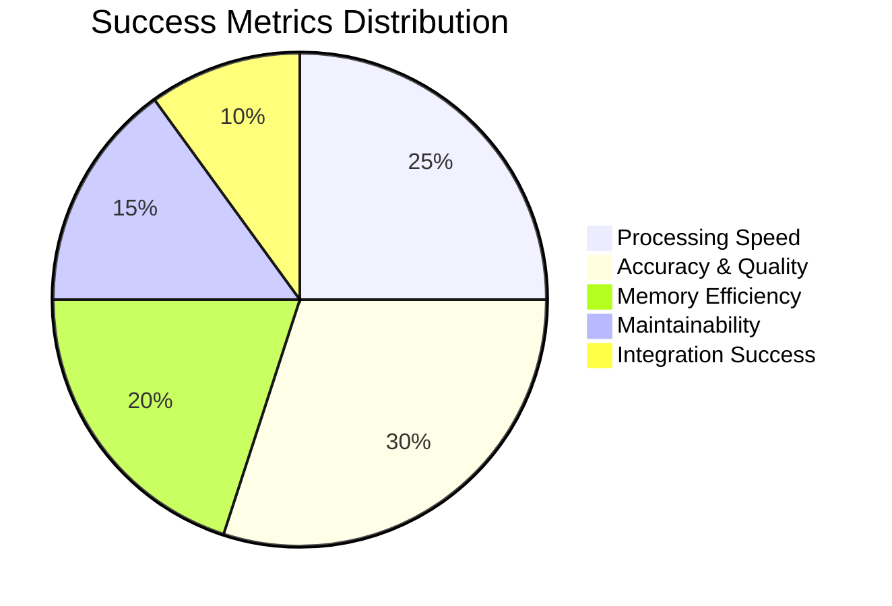

# Implementation Roadmap

## File Structure Overview

```
lib/rubysmithing/
├── routing/                          # Multi-provider LLM routing
│   ├── complexity_analyzer.rb        # ✅ DONE - Text complexity analysis
│   ├── sfl_analyzer.rb              # 🔄 EXISTS - SFL content classification
│   └── routing_decision.rb          # 🔄 EXISTS - Routing logic engine
├── segmentation/                     # 📋 BACKLOG - Stage 1: Semantic segmentation
│   ├── semantic_segmenter.rb        # 🆕 NEW - Main segmentation orchestrator
│   ├── recursive_chunker.rb         # 🆕 NEW - Recursive chunking strategies
│   └── coherence_analyzer.rb        # 🆕 NEW - Semantic coherence scoring
├── preprocessing/                    # 📋 BACKLOG - Stage 2: Token cleaning
│   ├── token_cleaner.rb             # 🆕 NEW - Main cleaning orchestrator
│   ├── linguistic_normalizer.rb     # 🆕 NEW - ruby-spacy integration
│   └── encoding_handler.rb          # 🆕 NEW - Text encoding normalization
├── tagging/                         # 📋 BACKLOG - Stage 3: Linguistic analysis
│   ├── pos_tagger.rb               # 🆕 NEW - Part-of-speech tagging
│   ├── ner_extractor.rb            # 🆕 NEW - Named entity recognition
│   ├── dependency_parser.rb        # 🆕 NEW - Syntactic dependencies
│   └── sfl_mapper.rb               # 🆕 NEW - SFL metafunction mapping
├── embedding/                       # 📋 BACKLOG - Stage 4: Vector generation
│   ├── vector_generator.rb         # 🆕 NEW - Embedding orchestrator
│   ├── pgvector_store.rb           # 🆕 NEW - PostgreSQL vector storage
│   └── reranker.rb                 # 🆕 NEW - informers cross-encoder
├── cache/                           # 📋 BACKLOG - Stage 5: Redis cache layer
│   ├── processing_session.rb       # 🆕 NEW - Session state management
│   ├── token_cache.rb              # 🆕 NEW - Token cache model
│   ├── embedding_cache.rb          # 🆕 NEW - Vector cache model
│   └── sfl_cache.rb                # 🆕 NEW - SFL analysis cache
├── models/                          # 📋 BACKLOG - Stage 6-7: Persistent storage
│   ├── document.rb                 # 🆕 NEW - Main document model
│   ├── linguistic_annotation.rb    # 🆕 NEW - JSONB linguistic data
│   ├── document_embedding.rb       # 🆕 NEW - pgvector embeddings
│   └── processing_session.rb       # 🆕 NEW - Archived session data
├── workflows/                       # ✅ DONE - DSPy workflow signatures
│   ├── natural_language_input.rb   # ✅ DONE - Input validation
│   ├── sfl_analysis.rb             # ✅ DONE - SFL analysis workflow
│   ├── user_story_generation.rb    # ✅ DONE - Story generation
│   ├── gherkin_generation.rb       # ✅ DONE - Feature generation
│   ├── test_execution.rb           # ✅ DONE - Test execution
│   └── sfl_bdd_orchestrator.rb     # ✅ DONE - Pipeline orchestrator
├── llm_providers.rb                 # ✅ DONE - Multi-provider configuration
├── model_router.rb                  # ✅ DONE - Main routing coordinator
└── logging.rb                       # ✅ DONE - Structured logging
```

## Implementation Priority Matrix



## Component Integration Timeline



## Gem Dependencies & Integration



## Quality Gates & Testing Strategy



## Risk Assessment & Mitigation

| Risk Level | Component | Risk Description | Mitigation Strategy |
|------------|-----------|------------------|-------------------|
| 🔴 HIGH | ruby-spacy Integration | Complex C extensions, potential memory leaks | Comprehensive testing, memory profiling, fallback to simpler tokenization |
| 🟡 MEDIUM | pgvector Performance | Large vector operations may impact PostgreSQL | Query optimization, indexing strategy, connection pooling |
| 🟡 MEDIUM | Multi-provider Routing | API rate limits, network failures | Circuit breaker pattern, retry logic, fallback providers |
| 🟢 LOW | Redis Cache | Memory usage with large datasets | TTL policies, cache eviction strategies, monitoring |
| 🟢 LOW | SFL Analysis | Complexity of linguistic analysis | Gradual implementation, validation thresholds, quality gates |

## Success Metrics



### Key Performance Indicators

- **Processing Throughput**: >1000 documents/hour
- **Memory Usage**: <2GB for 10K document corpus
- **Cache Hit Rate**: >80% for repeated operations
- **SFL Consistency**: >85% consistency threshold
- **API Response Time**: <500ms for embedding generation
- **Test Coverage**: >95% line coverage
- **Documentation Coverage**: 100% public API documentation