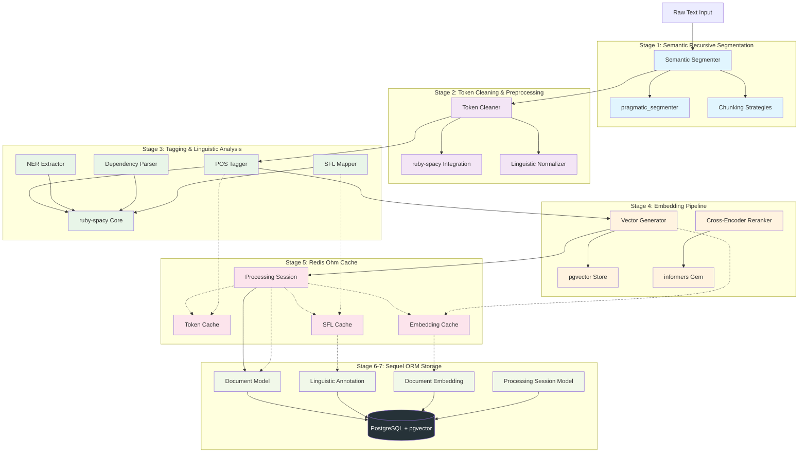
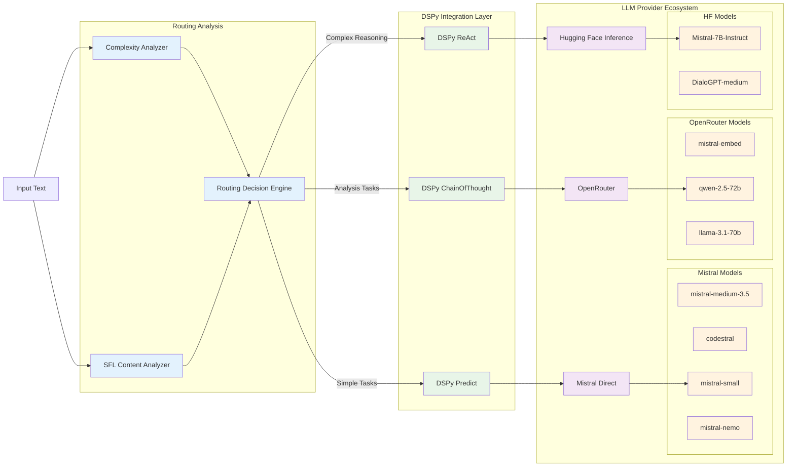
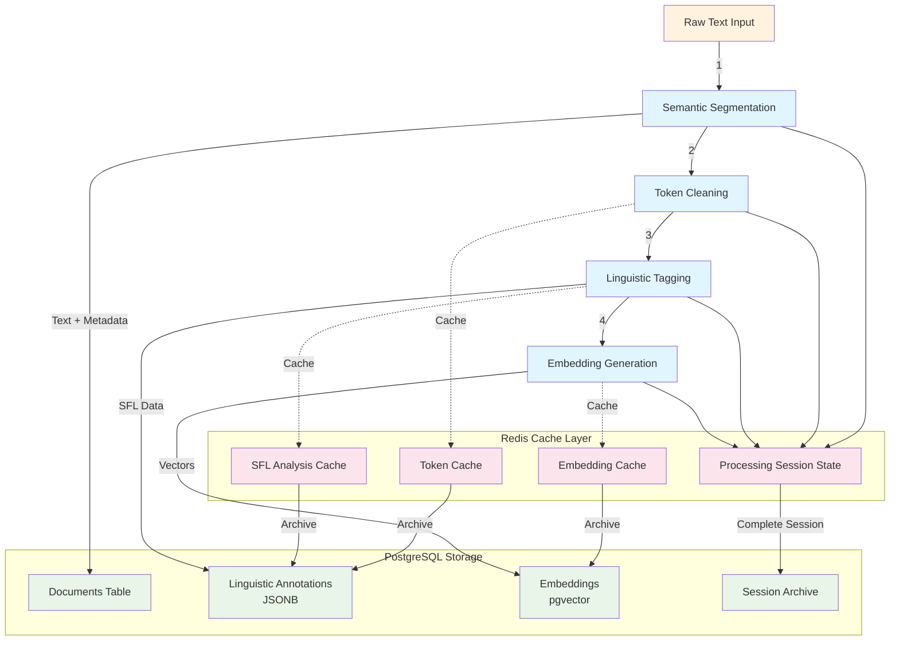
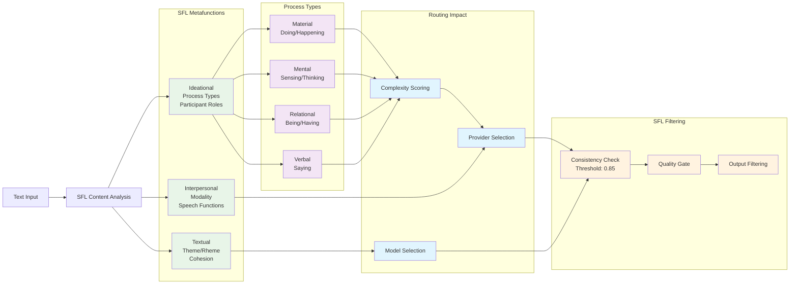
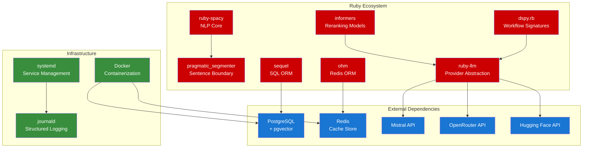

# NLP Pipeline Architecture

## Overview

7-stage semantic NLP pipeline with SFL filtering, multi-provider LLM routing, and hybrid storage architecture.

## System Architecture Diagram

## Multi-Provider LLM Routing Architecture

## Data Flow & State Management

## SFL Metafunction Integration

## Component Dependencies

