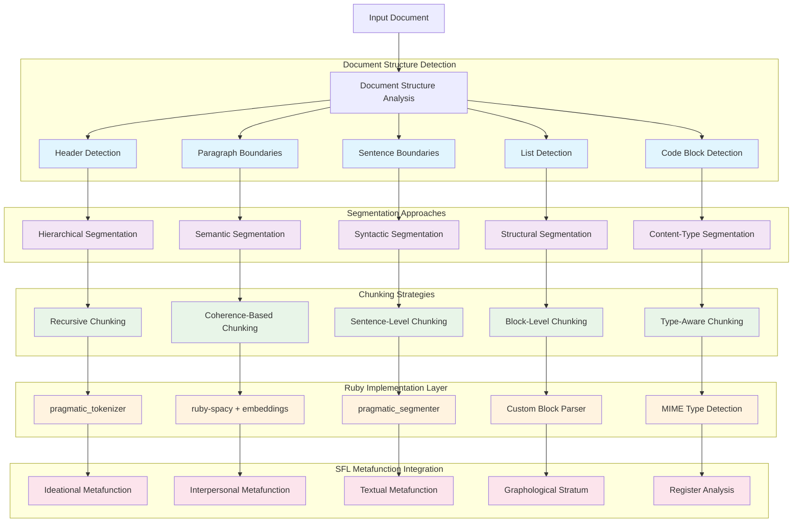
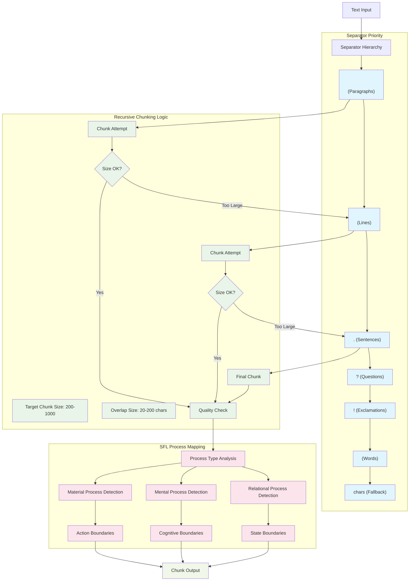
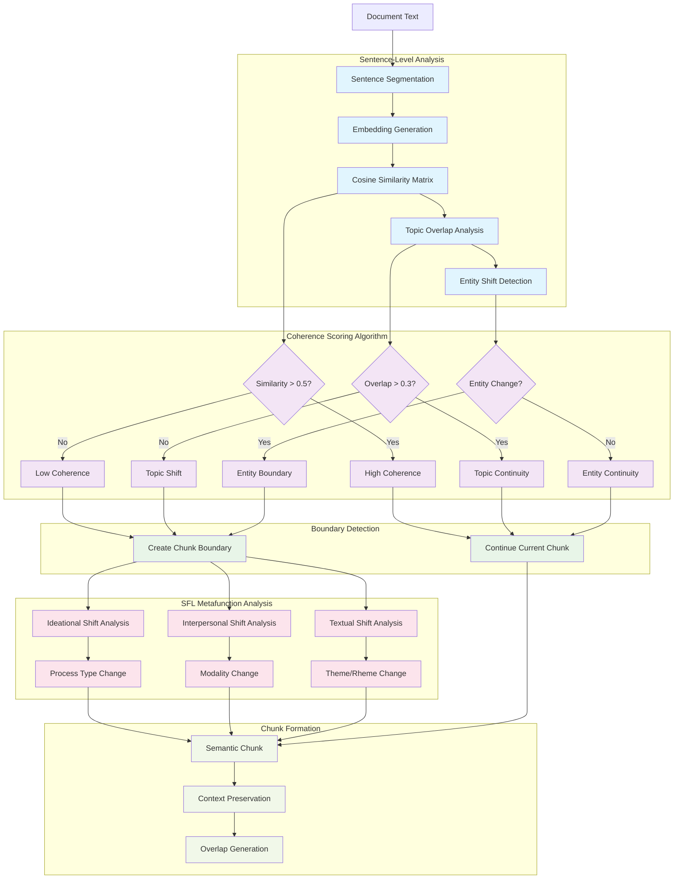

# Segmentation & Chunking Strategies

## Overview

Comprehensive mapping of text segmentation and chunking approaches for the NLP pipeline, with Ruby implementations and SFL integration patterns.

## Segmentation Strategy Matrix



## Chunking Strategy Comparison

| Strategy | Use Case | Chunk Size | Overlap | Ruby Gem | SFL Integration |
|----------|----------|------------|---------|----------|-----------------|
| **Recursive** | Generic documents | 200-1000 chars | 10-20% | `pragmatic_tokenizer` | Process boundaries |
| **Semantic** | Coherent content | Variable | Context-aware | `ruby-spacy` + embeddings | Topic coherence |
| **Syntactic** | Linguistic analysis | Sentence-based | Minimal | `pragmatic_segmenter` | Clause boundaries |
| **Hierarchical** | Structured docs | Section-based | None | Custom parser | Discourse structure |
| **Fixed-size** | Performance critical | Fixed tokens | Fixed overlap | Built-in | Character boundaries |
| **Sliding Window** | Context preservation | Fixed with step | High overlap | Custom | Contextual flow |

## Recursive Chunking Implementation



## Semantic Coherence Chunking



## Ruby Implementation Patterns

### 1. Recursive Chunking with pragmatic_tokenizer

```ruby
# lib/rubysmithing/segmentation/recursive_chunker.rb
class RecursiveChunker
  SEPARATORS = [
    "\n\n",    # Paragraphs
    "\n",      # Lines  
    ". ",      # Sentences
    "? ",      # Questions
    "! ",      # Exclamations
    " ",       # Words
    ""         # Characters
  ].freeze
  
  def initialize(chunk_size: 500, overlap_size: 50)
    @chunk_size = chunk_size
    @overlap_size = overlap_size
  end
  
  def chunk(text)
    _chunk_recursive(text, SEPARATORS, 0)
  end
  
  private
  
  def _chunk_recursive(text, separators, separator_index)
    return [text] if text.length <= @chunk_size
    
    separator = separators[separator_index]
    return [text] if separator_index >= separators.length - 1
    
    splits = text.split(separator)
    current_chunk = ""
    chunks = []
    
    splits.each do |split|
      if (current_chunk + separator + split).length <= @chunk_size
        current_chunk += separator + split unless current_chunk.empty?
        current_chunk = split if current_chunk.empty?
      else
        chunks << current_chunk unless current_chunk.empty?
        current_chunk = split
      end
    end
    
    chunks << current_chunk unless current_chunk.empty?
    
    # Apply overlap for context preservation
    apply_overlap(chunks)
  end
  
  def apply_overlap(chunks)
    return chunks if chunks.length <= 1
    
    overlapped_chunks = [chunks.first]
    
    (1...chunks.length).each do |i|
      overlap_text = chunks[i-1][-@overlap_size..-1] || chunks[i-1]
      overlapped_chunks << "#{overlap_text}#{chunks[i]}"
    end
    
    overlapped_chunks
  end
end
```

### 2. Semantic Coherence Chunking with ruby-spacy

```ruby
# lib/rubysmithing/segmentation/semantic_segmenter.rb
class SemanticSegmenter
  def initialize(similarity_threshold: 0.5, overlap_threshold: 0.3)
    @similarity_threshold = similarity_threshold
    @overlap_threshold = overlap_threshold
    @nlp = Spacy::Language.new('en_core_web_sm')
  end
  
  def segment(text)
    sentences = extract_sentences(text)
    embeddings = generate_embeddings(sentences)
    boundaries = detect_boundaries(sentences, embeddings)
    create_chunks(sentences, boundaries)
  end
  
  private
  
  def extract_sentences(text)
    doc = @nlp.call(text)
    doc.sents.map(&:text)
  end
  
  def generate_embeddings(sentences)
    sentences.map do |sentence|
      doc = @nlp.call(sentence)
      doc.vector
    end
  end
  
  def detect_boundaries(sentences, embeddings)
    boundaries = [0]
    
    (1...sentences.length).each do |i|
      similarity = cosine_similarity(embeddings[i-1], embeddings[i])
      topic_overlap = calculate_topic_overlap(sentences[i-1], sentences[i])
      entity_shift = detect_entity_shift(sentences[i-1], sentences[i])
      
      if similarity < @similarity_threshold || 
         topic_overlap < @overlap_threshold || 
         entity_shift
        boundaries << i
      end
    end
    
    boundaries << sentences.length
    boundaries.uniq
  end
  
  def cosine_similarity(vec1, vec2)
    dot_product = vec1.zip(vec2).sum { |a, b| a * b }
    magnitude1 = Math.sqrt(vec1.sum { |a| a * a })
    magnitude2 = Math.sqrt(vec2.sum { |a| a * a })
    
    return 0.0 if magnitude1 == 0 || magnitude2 == 0
    
    dot_product / (magnitude1 * magnitude2)
  end
  
  def calculate_topic_overlap(sent1, sent2)
    doc1 = @nlp.call(sent1)
    doc2 = @nlp.call(sent2)
    
    nouns1 = doc1.select { |token| token.pos == 'NOUN' }.map(&:lemma)
    nouns2 = doc2.select { |token| token.pos == 'NOUN' }.map(&:lemma)
    
    intersection = (nouns1 & nouns2).size
    union = (nouns1 | nouns2).size
    
    return 0.0 if union == 0
    intersection.to_f / union
  end
  
  def detect_entity_shift(sent1, sent2)
    doc1 = @nlp.call(sent1)
    doc2 = @nlp.call(sent2)
    
    entities1 = doc1.ents.map(&:label).to_set
    entities2 = doc2.ents.map(&:label).to_set
    
    # Significant entity shift if less than 50% overlap
    intersection = (entities1 & entities2).size
    union = (entities1 | entities2).size
    
    return false if union == 0
    (intersection.to_f / union) < 0.5
  end
  
  def create_chunks(sentences, boundaries)
    chunks = []
    
    (0...boundaries.length-1).each do |i|
      start_idx = boundaries[i]
      end_idx = boundaries[i+1]
      chunk_text = sentences[start_idx...end_idx].join(' ')
      chunks << chunk_text
    end
    
    chunks
  end
end
```

### 3. SFL-Aware Chunking

```ruby
# lib/rubysmithing/segmentation/sfl_chunker.rb
class SFLChunker
  def initialize
    @nlp = Spacy::Language.new('en_core_web_sm')
    @process_types = ProcessTypeClassifier.new
  end
  
  def chunk_by_metafunction(text)
    sentences = extract_sentences(text)
    metafunction_analysis = analyze_metafunctions(sentences)
    create_metafunction_chunks(sentences, metafunction_analysis)
  end
  
  private
  
  def analyze_metafunctions(sentences)
    sentences.map do |sentence|
      doc = @nlp.call(sentence)
      
      {
        ideational: analyze_ideational(doc),
        interpersonal: analyze_interpersonal(doc),
        textual: analyze_textual(doc)
      }
    end
  end
  
  def analyze_ideational(doc)
    # Process type analysis
    verbs = doc.select { |token| token.pos == 'VERB' }
    process_type = @process_types.classify(verbs.first&.lemma)
    
    # Participant roles
    participants = extract_participants(doc)
    
    # Circumstantial elements
    circumstances = extract_circumstances(doc)
    
    {
      process_type: process_type,
      participants: participants,
      circumstances: circumstances
    }
  end
  
  def analyze_interpersonal(doc)
    # Modality analysis
    modality = detect_modality(doc)
    
    # Speech function
    speech_function = classify_speech_function(doc)
    
    {
      modality: modality,
      speech_function: speech_function
    }
  end
  
  def analyze_textual(doc)
    # Theme/Rheme structure
    theme_rheme = analyze_theme_rheme(doc)
    
    # Cohesive devices
    cohesion = detect_cohesive_devices(doc)
    
    {
      theme_rheme: theme_rheme,
      cohesion: cohesion
    }
  end
  
  def create_metafunction_chunks(sentences, analyses)
    chunks = []
    current_chunk = []
    current_metafunction = nil
    
    sentences.zip(analyses).each do |sentence, analysis|
      metafunction_signature = create_metafunction_signature(analysis)
      
      if current_metafunction.nil? || 
         metafunction_similar?(current_metafunction, metafunction_signature)
        current_chunk << sentence
        current_metafunction = metafunction_signature
      else
        chunks << {
          text: current_chunk.join(' '),
          metafunction: current_metafunction
        }
        current_chunk = [sentence]
        current_metafunction = metafunction_signature
      end
    end
    
    chunks << {
      text: current_chunk.join(' '),
      metafunction: current_metafunction
    } unless current_chunk.empty?
    
    chunks
  end
  
  def create_metafunction_signature(analysis)
    {
      process_type: analysis[:ideational][:process_type],
      modality: analysis[:interpersonal][:modality],
      theme_type: analysis[:textual][:theme_rheme][:theme_type]
    }
  end
  
  def metafunction_similar?(sig1, sig2)
    sig1[:process_type] == sig2[:process_type] &&
    sig1[:modality] == sig2[:modality]
    # Allow theme variation within same chunk for now
  end
end
```

## Performance Optimization Patterns

```mermaid
graph LR
    %% Performance Considerations
    subgraph "Performance Optimization"
        TextInput[Large Text Input] --> SizeCheck{Size > 10MB?}
        
        SizeCheck --> |No| StandardChunking[Standard Chunking]
        SizeCheck --> |Yes| StreamChunking[Streaming Chunking]
        
        StandardChunking --> MemoryChunking[In-Memory Processing]
        StreamChunking --> DiskChunking[Disk-Based Processing]
        
        MemoryChunking --> ParallelProcessing[Parallel Processing]
        DiskChunking --> BatchProcessing[Batch Processing]
    end

    %% Caching Strategy
    subgraph "Caching Strategy"
        ParallelProcessing --> EmbeddingCache[Embedding Cache]
        BatchProcessing --> EmbeddingCache
        
        EmbeddingCache --> RedisCache[Redis Cache]
        RedisCache --> CacheHit{Cache Hit?}
        
        CacheHit --> |Yes| FastReturn[Fast Return]
        CacheHit --> |No| ComputeAndCache[Compute & Cache]
    end

    %% Quality Gates
    subgraph "Quality Assurance"
        FastReturn --> QualityCheck[Quality Check]
        ComputeAndCache --> QualityCheck
        
        QualityCheck --> ChunkValidation[Chunk Validation]
        ChunkValidation --> SFLValidation[SFL Validation]
        SFLValidation --> OutputChunks[Output Chunks]
    end

    %% Styling
    classDef performance fill:#e1f5fe
    classDef cache fill:#f3e5f5
    classDef quality fill:#e8f5e8
    
    class SizeCheck,StandardChunking,StreamChunking,MemoryChunking,DiskChunking,ParallelProcessing,BatchProcessing performance
    class EmbeddingCache,RedisCache,CacheHit,FastReturn,ComputeAndCache cache
    class QualityCheck,ChunkValidation,SFLValidation,OutputChunks quality
```



## Implementation Priority & Integration

1. **Phase 1**: Basic recursive chunking with pragmatic_tokenizer
2. **Phase 2**: Semantic coherence with ruby-spacy embeddings  
3. **Phase 3**: SFL metafunction-aware chunking
4. **Phase 4**: Performance optimization and caching
5. **Phase 5**: Quality validation and monitoring